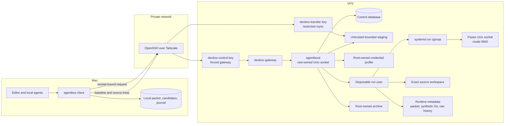
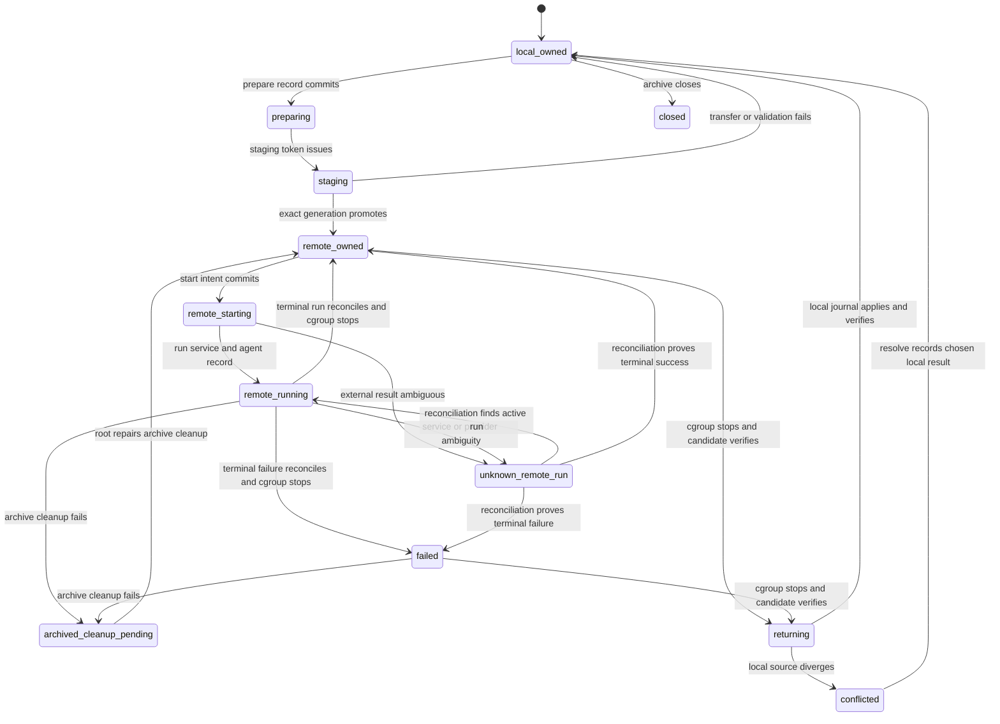

# DevBox system design

**Status:** DRAFT FOR IMPLEMENTATION REVIEW  
**Primary type:** System design  
**Created:** 2026-08-29  
**Authoritative location:** `/Users/sayertindall/Dev/DevBox/SPEC.md`  
**Requirements:** [REQUIREMENTS.md](REQUIREMENTS.md)  
**Evidence:** [RESEARCH.md](RESEARCH.md)

## Objective

Build a private system that moves a dirty local project and a structured task handoff to a VPS. The VPS starts a new Claude Code, Codex, or OMP run that continues after the Mac loses Internet access.

## Background

The local Mac has Paseo 0.6.1, Claude Code, Codex, and OMP. Paseo reports that all three providers are available locally. Paseo persists agent state on its daemon and does not end an idle agent because a client disconnects. Paseo also documents provider-runtime loss after a crash, OOM kill, or host suspend. [RESEARCH.md](RESEARCH.md) records the source evidence.

The VPS must own source data, task context, process supervision, provider credentials, and recovery state before DevBox starts a remote run. A laptop-mounted directory, raw client port forward, or live synchronization process cannot be a runtime dependency.

Current Paseo cross-host portability work does not transfer a provider-native session, Git working state, or repository placement. DevBox transfers a sanitized source projection and task packet. It starts a new provider process. It does not claim to migrate a live process.

DevBox validates Unix-socket support on the selected Paseo daemon and client before it creates a real run. Version 1 stops if the test fails. It has no TCP fallback.

## Goals

- Start Claude Code, Codex, or OMP on a VPS without a Git push.
- Include permitted dirty and untracked source files.
- Keep a remote run alive after the Mac disconnects or powers off.
- Serialize DevBox source handoff and return operations.
- Detect manual local divergence before reclaim overwrites a local path.
- Return a complete verified remote candidate with a rollback journal.
- Build a project environment from pinned Nix and devenv inputs.
- Keep normal control, transfer, provider, and socket endpoints private.
- Isolate each remote run from every earlier or concurrent run.

## Non-goals

- Live provider-process migration.
- General remote shell access through ordinary DevBox credentials.
- Direct client access to a raw Paseo endpoint.
- Continuous multi-writer synchronization.
- Mutagen, Syncthing, Unison, Git LFS, Git submodules, nested repositories, or case-colliding paths in version 1.
- Git remote hosting, pushes, pull requests, deployment credentials, cloud-console access, or multi-user tenancy.

## The system in one paragraph

The local `agentbox` client enrolls a project, creates a random enrollment identity, prepares a bound handoff packet, materializes two sanitized trees, and copies them to a bounded VPS staging path through restricted rsync. A root-owned VPS daemon named `agentboxd` validates the staging contents against positive manifests, creates an exact source generation, and records the source lease in a control database. The operator requests a provider run through a forced SSH command. `agentboxd` locks a credential profile, creates a disposable Unix user and systemd sandbox, injects only that profile's credential material, starts a run-local Paseo daemon on a mode-0600 Unix socket, and records the agent result after a durable start intent. The Mac can disappear. On return, `agentboxd` stops the run cgroup, builds a root-owned candidate from the source projection, and the local client verifies that candidate before it applies it through a journal.

## Architecture overview



The source workspace contains only source-manifest entries. Packet, synthetic Git state, raw output, service files, and receipts are runtime metadata outside that workspace. The normal Mac client cannot connect to any run socket.

## Deployment shape

### Roles

| Principal | Purpose | Permission boundary |
|---|---|---|
| `root` | Runs `agentboxd`, owns control state, credentials, archives, host config, service units, and user lifecycle. | Does not run provider work as a normal process. |
| `devbox-control` | Receives normal control SSH requests. | Forced `devbox-gateway` command only. No shell, PTY, forwarding, user rc, or arbitrary command. |
| `devbox-transfer` | Receives source transfer requests. | Rsync server wrapper only below one bounded staging token. No shell, forwarding, or control access. |
| Credential profile | Root-owned provider credential material and policy. | Supplies one selected secret to one run sandbox. It is not a Unix login identity. |
| `devbox-run-<id>` | Server-created disposable Unix user for one run. | Reads only one workspace, one packet, one `PASEO_HOME`, one selected secret, and one run socket. |
| Break-glass operator | Disabled administrative identity. | Exists only for a logged incident response. |

Each run gets a new run user. The server never reuses a run user for another project or operation. A credential profile has one active-run lock in version 1. A second simultaneous provider run needs another credential profile.

### Filesystem layout

```text
/srv/devbox/
  control/
    devbox.db
    backups/
  credentials/
    <credential-profile>/
  staging/
    <staging-token>/
      baseline/
      source/
      packet.json
      manifests/
  generations/
    <project-id>/<generation>/
      source/
      baseline/
  runs/
    <run-id>/
      workspace/
      metadata/
        handoff.json
        git/
        paseo-home/
        raw-history/
        paseo.sock
  archives/
    <run-id>/
      workspace/
      metadata/
```

`root` owns `control`, `credentials`, `generations`, and `archives`. A run user owns only its own `runs/<run-id>` tree while the run is active. On terminal archive, `agentboxd` stops the cgroup, moves metadata and workspace into `archives`, removes run-user access, and then permits another run to use the credential profile.

### Host configuration

A root-owned host configuration file defines these values before DevBox accepts real work:

```toml
version = 1
root = "/srv/devbox"
tailscale_interface = "tailscale0"
ssh_port = 22
staging_max_bytes = 0
staging_quota_backend = "project-quota"
run_max_bytes = 0
run_quota_backend = "project-quota"
run_memory_max = "host-chosen-size"
run_cpu_quota = "host-chosen-percent"
run_tasks_max = 0
monitor_interval = "host-chosen-duration"

[retention]
receipts = "host-chosen-duration"
raw_output = "host-chosen-duration"
archives = "host-chosen-duration"
staging = "host-chosen-duration"
database_backups = "host-chosen-duration"

[[credential_profiles]]
id = "codex-primary"
provider = "codex"
max_active_runs = 1
credential_injection_adaptor = "host-approved-adaptor"
egress_policy = "server-recorded-policy"
allowed_hosts = ["provider-configured-hosts"]
allowed_ports = [443]
```

The bootstrap rejects an absent or invalid host configuration. The actual values are operator decisions after the host audit. `staging_max_bytes` must cover prepared manifest bytes plus defined metadata overhead. `staging_quota_backend` must name a host-supported filesystem project-quota mechanism. `run_max_bytes`, `run_quota_backend`, `run_memory_max`, `run_cpu_quota`, and `run_tasks_max` are required. DevBox stops if the host cannot enforce token or run quotas and cgroup limits.

### `agentboxd`

`agentboxd` runs as root. It listens only on a Unix domain socket owned by `root:devbox-control` with mode `0660`. It has no TCP listener.

`agentboxd` owns:

- project enrollment and canonical server path resolution;
- control database, database backup, events, receipts, operations, source leases, and credential-profile locks;
- staging-token issuance, manifest validation, generation promotion, run-user lifecycle, run-cgroup stop, archive, and retention cleanup;
- credential injection, project environment verification, run-local Paseo lifecycle, start reconciliation, cancel, return preparation, and raw-output authorization;
- break-glass event recording.

The service uses SQLite in WAL mode. A writer operation starts `BEGIN IMMEDIATE`, validates the expected receipt revision, locks the project and credential profile, inserts an operation with its immutable request digest, updates the receipt, and appends an event. It commits durable intent before an external side effect. It commits a known external result before it replies. If the result is uncertain, it commits a blocking unknown state.

A root-owned backup worker uses SQLite's online backup mechanism to create a new temporary backup, verifies it, fsyncs it, and atomically renames it into `control/backups`. Backup retention is independent from run archive retention.

The backup worker also supports a restore drill. It loads the newest verified backup into an isolated database, runs integrity checks, compares active receipt records with live run units, and records reconciliation results. It never replaces production control state until the isolated restore and reconciliation pass.

`agentboxd restore-control` is a root-only break-glass operation. It blocks new writer requests, restores a selected verified backup into a temporary control database, reconciles every active receipt with live run units and sockets, then atomically replaces production control state only if that reconciliation succeeds. An unresolved run remains unknown and blocks replacement. The operation writes a restore event before and after each phase.

### Run service

`agentboxd` creates a systemd unit for each run. Before it creates the run user, it assigns the whole `/srv/devbox/runs/<run-id>` tree to the host-enforced run project quota. The unit runs as `devbox-run-<id>` and receives a root-created run directory and a selected credential injection. It has these minimum service properties:

```text
User=devbox-run-<id>
NoNewPrivileges=yes
PrivateTmp=yes
PrivateDevices=yes
ProtectHome=yes
ProtectSystem=strict
ReadWritePaths=/srv/devbox/runs/<run-id>
MemoryMax=<host-run-memory-max>
CPUQuota=<host-run-cpu-quota>
TasksMax=<host-run-tasks-max>
```

The exact provider injection method belongs to the credential-profile adaptor. It may use systemd credentials, a root-owned read-only bind mount, or another vendor-supported local file path. It must expose only the selected credential material. It must not expose a credential profile directory or a sibling run path.

The unit starts Paseo with this shape:

```text
<PASEO_BIN> daemon start --foreground --listen /srv/devbox/runs/<run-id>/metadata/paseo.sock --no-web-ui --no-relay
```

The socket has owner `devbox-run-<id>` and mode `0600`. Root can connect. A sibling run user cannot connect. The unit creates no TCP listener.

### Paseo Unix-socket capability gate

Before a real run service starts, host bootstrap runs an isolated test using the exact installed daemon and client:

```text
<PASEO_BIN> daemon start --foreground --listen <temporary-socket> --no-web-ui --no-relay
<PASEO_BIN> ls --host <temporary-socket> --json
```

The test must listen, query, and stop cleanly. It runs under a temporary nonprivileged test identity. Failure blocks DevBox provisioning. Version 1 has no TCP fallback because host-wide loopback TCP would let a sibling run user reach another run daemon.

## Durable data model

### Enrollment

`agentbox init` generates a random `enrollment_id` and stores it below `.agentbox`. `agentbox enroll` sends `SHA-256(enrollment_id)` to `agentboxd`. The database stores the hash as `enrollment_hash`.

A server registration request succeeds only when the project ID is new, or when its stored enrollment hash matches the request. The enrollment hash identifies the local DevBox configuration. It is not a provider credential or a filesystem authority.

### Source and runtime boundaries

The current source manifest and baseline manifest are positive allowlists. Each entry has a normalized relative path, kind, executable bit, size, content digest, and allowed relative symlink target.

The **source projection** is exactly the current source manifest. `agentboxd` materializes no extra source file in the workspace. The **runtime metadata** is outside the workspace:

```text
runs/<run-id>/workspace/            source projection only
runs/<run-id>/metadata/handoff.json packet, read-only to run user
runs/<run-id>/metadata/git/         synthetic Git directory
runs/<run-id>/metadata/paseo-home/  run-local Paseo state
runs/<run-id>/metadata/raw-history/ raw provider output
runs/<run-id>/metadata/paseo.sock   run-local endpoint
```

The environment wrapper sets `GIT_DIR` to `metadata/git` and `GIT_WORK_TREE` to `workspace`. It sets `DEVBOX_HANDOFF_FILE` to `metadata/handoff.json`. This gives a run access to a synthetic Git diff without placing `.git` or `.agentbox` inside the source projection.

### Sanitized baseline

For a Git project, the local client materializes allowed files from `HEAD` into a baseline tree. It materializes allowed current files into a source tree. It never transfers a raw Git bundle, object store, or `.git` directory.

`agentboxd` creates a synthetic Git directory outside the workspace. It commits the sanitized baseline, overlays source-manifest entries into the workspace, deletes baseline paths absent from current source, and verifies that workspace against the source manifest. For a non-Git project, it commits the current source projection as the synthetic baseline before the provider changes files. `agentbox diff` uses this synthetic Git state for every project type.

### Packet and operations

```json
{
  "version": 1,
  "handoff_id": "uuid",
  "prepare_operation_id": "uuid",
  "project_id": "example-api",
  "source_manifest_sha256": "hex",
  "baseline_manifest_sha256": "hex-or-null",
  "base_revision": "label-or-null",
  "task": "Fix the focused failing behavior.",
  "current_state": "What changed and what failed.",
  "next_action": "Run the focused reproduction before editing.",
  "constraints": ["Do not commit", "Do not read secrets"],
  "created_at": "RFC-3339 timestamp"
}
```

The packet is immutable after prepare. It contains no transcript dump, credential, private key, or environment value. Its digest, source manifest digest, and baseline manifest digest are recorded before a staging token is issued.

The control database records these durable facts:

```text
projects: project_id, enrollment_hash, source policy, environment policy
handoffs: handoff_id, packet digest, source digest, baseline digest, staging token
operations: operation_id, request digest, type, state, known result, error code
source_leases: project_id, generation, state, revision, operation_id
credential_locks: profile_id, active operation_id
runs: run_id, operation_id, user, systemd unit, socket, agent ID, state
events: time, actor, old state, new state, result
receipts: user-readable view of handoff, generation, run, and return state
```

### Staging

`agentboxd` issues a unique staging token after it stores the prepared packet and manifests. It stores token expiry, byte quota, handoff ID, expected manifest digests, and an enforced filesystem project-quota identifier. The transfer key can write only below that token root.

Rsync cannot be a source of authority. The local client sends a `--files-from` list derived from the positive manifest. A compromised transfer key may still write unexpected bytes inside its host-enforced quota. That data stays untrusted in staging. `agentboxd` rewalks the directory and rejects every extra, missing, mismatched, or unsafe path before it creates a generation.

## State machine



`agentboxd` owns every transition. A local manual source edit may happen outside DevBox. It becomes visible only when the reclaim manifest comparison detects it.

## Interfaces and protocols

### SSH identities

| Identity | Forced command | Authority |
|---|---|---|
| Control key | `devbox-gateway` | Send one versioned receipt-bound request to `agentboxd`. |
| Transfer key | staging rsync wrapper | Write baseline and source trees below one bounded token root. |

Both keys use `no-port-forwarding`, `no-agent-forwarding`, `no-X11-forwarding`, `no-pty`, and `no-user-rc`. The normal client never has a break-glass key.

### Local commands

| Command | Result |
|---|---|
| `agentbox init` | Creates local configuration and enrollment ID. |
| `agentbox enroll` | Registers the project with its enrollment hash. |
| `agentbox prepare` | Writes packet, manifests, and local prepare record. |
| `agentbox handoff` | Uploads bounded trees and requests exact generation activation. |
| `agentbox run` | Requests a server-side start for a provider. |
| `agentbox status` | Reads receipt, run state, and reconciliation result. |
| `agentbox attach` | Streams live receipt-bound provider output. |
| `agentbox logs` | Streams active or archived receipt-bound raw output. |
| `agentbox diff` | Returns synthetic Git diff for Git or non-Git project. |
| `agentbox cancel` | Requests cancellation and run-cgroup reconciliation. |
| `agentbox reclaim` | Requests a candidate and applies it only after local verification. |
| `agentbox resolve` | Records confirmed conflict resolution. |
| `agentbox recover` | Restores or completes an interrupted local apply. |
| `agentbox resume` | Starts a fresh sandbox from a terminal or explicitly abandoned receipt. |
| `agentbox doctor` | Reports local and host facts. It changes nothing. |

### Client workflows

`agentbox handoff` is a client workflow, not one protocol operation. It requests a staging token, uploads baseline and source trees through the transfer key, then sends `stage` and `activate` requests with distinct idempotency identifiers.

`agentbox reclaim` is also a client workflow. It requests `prepare_return`, downloads and verifies the return candidate, performs local journaled apply or records conflict, then sends `reclaim_complete` or `resolve`. Each server request has its own operation identifier and expected receipt revision.

`agentbox resume` requests `start_run` with a new operation identifier after the server verifies that the prior run is terminal or explicitly abandoned.

The local client persists each workflow under `.agentbox/workflows/<workflow-id>.json`. Before it issues a token, staging, activation, return, reclaim-complete, resolve, or resume request, it writes the child operation ID, expected receipt revision, stage, and `pending` outcome to a temporary file, fsyncs it, renames it, and fsyncs the parent directory. It records a known response with the same sequence. On restart, an `unknown` workflow calls `status` and server operation lookup before it sends another child request.

### Control request

The gateway reads one newline-delimited JSON request and forwards it unchanged to `agentboxd` over its Unix socket. It has no shell execution path.

```json
{
  "version": 1,
  "operation_id": "uuid",
  "operation": "start_run",
  "project_id": "example-api",
  "receipt_id": "uuid",
  "provider": "codex"
}
```

For `start_run`, the server trusts only operation ID, registered project ID, receipt ID, and provider name. It derives source generation, credential profile, run ID, run user, packet, environment wrapper, unit path, and socket from its database.

### Run start

`agentboxd` runs this ordered operation inside a project and credential-profile transaction:

1. Verify `remote_owned` receipt state and no active or unknown operation.
2. Lock the selected credential profile.
3. Verify environment identity, credential verification metadata, retention policy, and Unix-socket capability status.
4. Insert `start_run` with state `starting`.
5. Change the receipt to `remote_starting` and commit durable intent.
6. Create a unique run ID, run user, run directory, packet copy, synthetic Git metadata, and systemd unit.
7. Start the run unit and wait for its Unix socket readiness.
8. Run Paseo diagnostics through the run socket as root.
9. Start `paseo run --background` through the run socket. Set DevBox operation and receipt labels. The prompt instructs the provider to read `DEVBOX_HANDOFF_FILE`.
10. On known success, record agent ID and `remote_running` before reply.
11. On known failure, stop the run cgroup, archive metadata, release the credential lock, and record `failed`.
12. On ambiguity after durable intent, record `unknown_remote_run`. Reconciliation blocks all writer-affecting requests until it proves the result.

### Reconciliation and terminal archive

A monitor worker queries each active run socket for agents carrying the run operation label. It also checks the systemd unit state. A missing response from an unavailable socket is not proof that the agent ended.

After a terminal run, `agentboxd` stops the entire run cgroup. It requires successful service stop before it freezes a candidate or releases a credential-profile lock. It verifies that the cgroup has no process, archives workspace and runtime metadata under root ownership, removes the run socket, removes the systemd unit and drop-in, reloads systemd, deletes the run user and group, and verifies that the UID no longer owns an active path. If cleanup is incomplete, the receipt enters `archived_cleanup_pending` and the credential profile remains locked.

### Return and local apply

`agentbox reclaim` performs these steps:

1. Reconcile the receipt. Reject active, starting, or unknown runs.
2. Stop the run cgroup. Reject the operation if stop cannot be proven.
3. Build and verify a root-owned return manifest from every allowed source path present after the stopped run. The return manifest may include agent-created allowed files.
4. Download the candidate to `.agentbox/returns/<receipt-id>/candidate`.
5. Verify the candidate manifest before it touches the local project.
6. Compare current local source manifest with the original handoff source manifest.
7. On mismatch, record `conflicted` and modify neither source tree.
8. On match, fsync a rollback journal and path backups under `.agentbox/rollback/<receipt-id>`.
9. Apply only return-manifest additions, replacements, and deletions. Do not change an excluded path.
10. Verify final local manifest. Mark local ownership only after the journal completes.

`agentbox resolve` is the only normal exit from `conflicted`. It requires explicit confirmation, proof that no run cgroup remains, a chosen local manifest, and a control event. `agentbox recover` reads an incomplete journal and restores original paths or finishes the verified candidate.

## Environment and credential design

### Project environment

Projects declare a Nix flake lock and devenv configuration, or a server-approved opt-out reason. Enrollment records the environment identity from lock digest, wrapper version, and Linux architecture.

The run wrapper receives only a server-resolved workspace and expected environment identity. It verifies the identity, sets `GIT_DIR`, `GIT_WORK_TREE`, and `DEVBOX_HANDOFF_FILE`, runs the configured `devenv shell --` command, then executes the provider binary.

### Credential profiles

A credential profile is root-owned metadata and secret material. It has a provider name, verification state, revocation-test result, credential injection adaptor, and one-active-run limit. It is not a shared Unix user.

Credential provisioning occurs on the VPS. The operator selects a vendor-approved headless login or scoped API key. The system records provider, profile, verification time, expiry when known, and revocation-test result. It never records a secret value or copies Mac session state.

A root-controlled run adaptor injects only selected profile material into one new run sandbox. The adaptor must prove that a run cannot read its source profile directory, another credential, or a prior run's state. A profile is unavailable until its injection and revocation checks pass.

### Run egress

`agentboxd` selects a server-recorded egress policy before it creates a run sandbox. The policy has a default deny action and a small allowed set of model-provider domains, ports, DNS services, and package registries. It always denies loopback, private networks, link-local addresses, cloud metadata, Tailscale ranges, host services, and sibling runs.

The runtime adapter proves enforcement before the run receives a credential. A Microsandbox adapter uses domain rules, DNS pinning, TLS identity checks, and host-bound secret substitution. A systemd adapter remains unavailable until a root-owned network namespace, egress proxy, or equivalent policy can prove the same destination constraints. The run user cannot edit or broaden the policy.

## Security design

### Assets and boundaries

| Asset | Boundary | Main control |
|---|---|---|
| Source projection | Mac to staging, staging to generation, candidate to local tree | Positive manifests, quota, candidate verification, journal |
| Provider credential | Root profile store to one run sandbox | Root-controlled selected injection and per-run user |
| Control state | Gateway to `agentboxd` | Unix socket, transactions, revisions, operation IDs |
| Raw output | Run sandbox to operator | Root archive and receipt-bound stream only |
| SSH and Tailscale identity | Mac to VPS | Tailnet grants, host firewall, forced commands |
| Run socket | Root controller to run sandbox | Mode-0600 Unix socket per run |
| Deployment authority | Run sandbox to infrastructure | No deploy or cloud-console secret in sandbox |
| Outbound provider traffic | Run sandbox to Internet | Server-recorded deny-by-default egress policy |

### Controls

- **Deny-by-default:** Tailscale grants allow the selected Mac identity to reach only VPS SSH. The host firewall accepts TCP 22 only on the Tailscale interface and rejects public SSH. An off-tailnet probe verifies that public SSH fails.
- **Egress deny-by-default:** A run starts with outbound access denied. Only the selected server-recorded provider, DNS, and package destinations may pass. The adapter blocks private, metadata, host, Tailscale, and sibling-run ranges.
- **Fail-closed:** A digest mismatch, staging or run quota error, unknown operation, unknown run, failed cgroup stop, missing profile, missing retention policy, lock failure, database failure, or socket capability failure blocks source mutation.
- **Least privilege:** Control, transfer, root controller, credential profile, and run sandbox are separate roles. A run has only one source projection and selected credential material.
- **Two axes, scope × role:** The server resolves a registered project, source lease, and allowed role for each request. A project identifier is not authority. A valid control key is not raw Paseo authority.
- **Anti-IDOR:** The server resolves every path from database state. No request can name a workspace, run ID, credential path, or socket as authority.
- **Append-only audit:** The control database writes one event for every state transition, run lifecycle action, archive, cleanup, backup, and break-glass action. Root-owned backups leave the run sandbox.
- **Deploy-authority separation:** A run sandbox has no sudo, Docker socket, deployment credential, or cloud-console token.
- **Break-glass:** A disabled separate admin identity may inspect an incident after explicit activation. The server records activation and expiry.

### Raw output

Raw provider output may contain source content or a secret printed by a tool. DevBox treats it as sensitive. The control database stores lifecycle facts only. `attach` and `logs` stream run or archive output only after receipt authorization. They never append streamed bytes to a receipt, event, or generic daemon log.

## Reliability and operations

### Host checks

`agentbox doctor` reports:

1. Tailscale reachability, SSH host key, forced command behavior, and off-tailnet SSH denial evidence.
2. Transfer wrapper containment, staging quota, expiry, and path-escape result.
3. Control database health, backup freshness, unresolved operation count, and retention configuration.
4. Run service, run-user, socket mode, archive, cgroup, project-quota assignment, and `MemoryMax`, `CPUQuota`, and `TasksMax` facts.
5. Credential-profile verification and revocation metadata.
6. Project environment identity, build result, and synthetic Git state.
7. Disk, memory, CPU, selected Linux architecture, supported provider binaries, and Unix-socket capability result.
8. Server-recorded egress policy, adapter enforcement result, allowed destination set, and denied-destination probe result.

The command reports facts. It does not repair the VPS.

### Retention

The host policy defines receipt, raw-output, archive, staging, and database-backup retention values. A root-owned cleanup worker deletes only eligible closed artifacts. It does not delete an active, starting, unknown, returning, conflicted, archived-for-reclaim, or journal-recovery path. It appends an event for each deletion.

The backup timer also runs a scheduled isolated restore drill. It verifies the newest backup and reconciles its active run records against live systemd units and run archives. A failed drill blocks new real runs until an operator repairs control state.

### SLOs

No numeric capacity or latency target exists because no VPS capacity evidence exists. DevBox defines these correctness objectives:

- A run acknowledged by `agentboxd` has no Mac connection dependency.
- An unexpected staging path never becomes source projection.
- An uncertain start or terminal state blocks another writer and return.
- A run cgroup stops before return candidate creation.
- A candidate verifies before local project mutation.
- A normal client cannot bypass receipt authorization or reach a run socket.
- A run sandbox cannot exceed host-defined storage, memory, CPU, or task limits or reduce control-state and sibling-run availability.
- A run sandbox can reach only its server-recorded egress destinations.

The host audit sets numeric capacity and latency targets before production use.

## End-to-end scenarios

### Normal handoff

1. Mira creates a project config and enrollment ID.
2. Mira enrolls the project through the control gateway.
3. Mira prepares a packet, current source manifest, baseline manifest, and local record.
4. Mira transfers source and baseline trees through the bounded transfer key.
5. `agentboxd` validates staging and creates generation 7.
6. Mira requests `agentbox run --provider codex`.
7. `agentboxd` locks `codex-primary`, creates run sandbox 42, starts the unit, validates the socket, starts Codex, and records its agent ID.
8. Mira closes the Mac. Codex continues because the VPS owns the run user, cgroup, source projection, packet, socket, and credential injection.
9. After terminal reconciliation, `agentboxd` stops run 42 and archives runtime metadata.
10. Mira reconnects. `agentbox reclaim` verifies and applies the candidate if the local source has not diverged.

### Start ambiguity

1. `agentboxd` commits `remote_starting` for operation `op-123`.
2. The run socket accepts a Paseo start call, but `agentboxd` exits before it records the agent ID.
3. On restart, it examines run 42's systemd unit and queries the run socket for label `devbox.operation=op-123`.
4. If it finds one active agent, it records that agent and marks `remote_running`.
5. If it cannot prove the state, it marks `unknown_remote_run`.
6. No source mutation, return, reclaim, close, resolve, or credential-profile reuse happens until reconciliation or break-glass resolves it.

### Mac disconnect

1. A validated OMP run has `remote_running` state.
2. The Mac loses power. The control SSH session ends.
3. Run 42 remains in its VPS cgroup. No local mount, raw port forward, or live sync session is required.
4. The server monitor continues reconciliation on the VPS.
5. A new control request reads the receipt after the Mac reconnects.

### Manual local divergence

1. The remote run owns the DevBox source lease.
2. Mira manually edits the local project outside DevBox.
3. The remote run ends and the server builds a verified candidate.
4. The local current manifest differs from the handoff source manifest.
5. DevBox records `conflicted`. It changes neither tree.
6. Mira resolves the files. `agentbox resolve` records the result and returns local source lease ownership.

### Provider failure

1. The run unit exits because of an OOM kill or authentication failure.
2. The monitor records terminal failure or blocking unknown state.
3. The server stops the cgroup and root archives the run data when safe.
4. The operator fixes the credential profile or host condition.
5. `agentbox resume` creates a fresh run user and sandbox from the stored generation and packet. It never claims that the old provider process resumed.

## Alternatives considered

| Alternative | Why it lost |
|---|---|
| Raw SSH tunnel to Paseo | It bypasses receipt and source-lease authorization. |
| Shared provider Unix user | A later or sibling project can read shared workspace, raw history, or credentials. |
| Per-profile TCP loopback port | A sibling Unix user can connect to host loopback. Version 1 uses mode-0600 run Unix sockets only. |
| Mutagen as first transfer adapter | Its remote connector needs another restricted-identity design. Restricted rsync has a smaller initial boundary. |
| Syncthing or Unison | They solve peer sync, not receipt-bound remote execution. |
| Raw Git bundle transfer | Git history can contain an excluded tracked secret. Sanitized materialization avoids that transfer. |
| Continuous bidirectional sync | It conflicts with offline source ownership and return conflict handling. |
| Coder, DevPod, or hosted remote IDE | They do not remove dirty-worktree, credential, and offline ownership contracts. |
| Provider-native session migration | Current provider and Paseo contracts do not supply a safe dirty-worktree process migration path. |

## Resolved decisions

| ID | Decision | Reason |
|---|---|---|
| D-001 | The VPS owns active execution. | This is the required offline behavior. |
| D-002 | `agentboxd` owns project, source lease, operation, profile lock, and receipt state. | Local state and raw clients cannot become authoritative. |
| D-003 | Normal control uses a forced SSH gateway. | It removes raw command and port access. |
| D-004 | Version 1 uses bounded restricted rsync staging. | It gives a small auditable transfer boundary. |
| D-005 | Each run has a disposable Unix user, cgroup, Paseo state, and socket. | A later run cannot read a prior run's state. |
| D-006 | Synthetic Git state and packets remain outside source workspace. | Source manifests stay exact and return stays clean. |
| D-007 | SQLite transactions, revisions, and operation IDs serialize server mutations. | Source leases and run starts must survive concurrent requests and restart ambiguity. |
| D-008 | Raw provider output is sensitive run metadata. | The control log needs no source content or secret values. |
| D-009 | Nix flakes and devenv define project environments. | The VPS needs reproducible Linux dependencies. |
| D-010 | `agentbox` is the command name. | It avoids collision with Jetify Devbox. |

## Open issues

| ID | Issue | Proposed resolution | Next step |
|---|---|---|---|
| OD-001 | VPS facts are unknown. | Keep host values in root-owned host config. | Run the read-only host audit. |
| OD-002 | Credential-profile and concurrent-run count is unknown. | Start with one profile per provider and one active run per profile. | Define capacity after audit. |
| OD-003 | Project inventory is unknown. | Enroll one project and reject unsupported Git shapes. | Run local preflight. |
| OD-004 | Provider credential injection is unknown. | Build one root-controlled adaptor and verification test per provider. | Select vendor-approved methods. |
| OD-005 | Retention values are unknown. | Require host policy before real runs. | Choose values after disk and sensitivity review. |
| OD-006 | Per-provider egress destination set and systemd fallback enforcement adapter | A run cannot receive a credential until its deny-by-default policy is verified. | Define provider host and DNS sets, then prove adapter enforcement. |

## Requirements traceability

| Design element | Requirements |
|---|---|
| Enrollment, project registry, and host config | FR-001, FR-012, NFR-SEC-001, INV-002 |
| Prepare, manifests, sanitized baseline, and staging quota | FR-002 through FR-005, NFR-SEC-003, INV-003 |
| Run sandbox, credential injection, and start reconciliation | FR-006, FR-007, FR-010, FR-011, NFR-REL-001, NFR-REL-002 |
| Synthetic Git, packet, output, and archive boundary | FR-005, FR-008, NFR-OBS-001, INV-003 |
| Return candidate, journal, resolve, and recover | FR-009, INV-001, INV-008, INV-009 |
| Run quotas and cgroup limits | FR-006, NFR-REL-003, CON-010, INV-010 |
| Per-run egress policy | NFR-SEC-004, CON-011, INV-011 |
| Tailscale, forced SSH, Unix socket, and firewall | NFR-SEC-001, NFR-SEC-002, CON-005 through CON-008 |
| Nix, devenv, and wrapper | NFR-MAINT-001 |
| Host audit and cross-platform test matrix | NFR-PORT-001 |

## Review questions

1. Which VPS host, Linux distribution, CPU architecture, firewall manager, and storage capacity will run DevBox?
2. Which vendor-approved credential injection method is allowed for each provider?
3. How many credential profiles and concurrent runs are required at the first launch?
4. Which project should become the first enrolled project?
5. What retention values fit the VPS storage and source sensitivity?